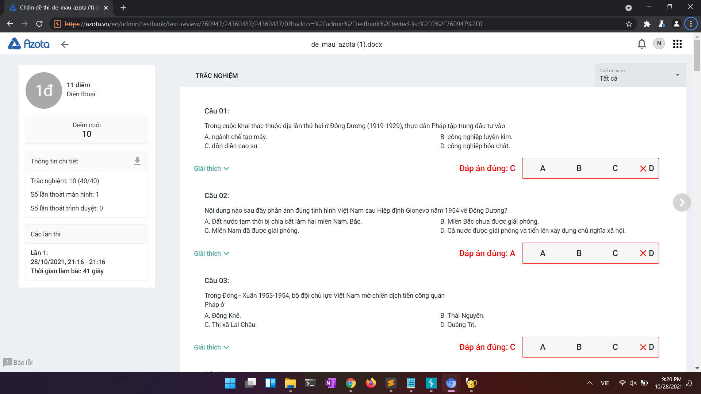

# Azota-Exploit

An exploit of the **patched** vulnerability in [AZOTA](https://azota.vn/) that occurred from **October 2021** to **February 2022**.

## Disclaimer

The vulnerability has been patched at the beginning of 2022.

Moreover, the underlying concept of the vulnerability is fairly simple and straightforward, and disclosing the vulnerability alone does not affect or further reveal any sensitive part of AZOTA's code. Therefore, this write-up is just for documentational and educational purpose.

## Context

[AZOTA](https://azota.vn/) is one of the most popular Vietnamese online examination platforms, and the most commonly used platform during the COVID-19 outbreak in Vietnam in 2021.

A test on AZOTA typically consists of multiple questions. Most commonly, the question are of type *single-selection multiple-choice question*, i.e only 1 answer is considered correct. Students get 0 point for empty or wrong answer, and 1 point otherwise.

## The Vulnerability

Normally, the server side processes input from the client side. In this case, the system takes in the student's submission, and grade it using the pre-defined solutions. The code *might* look like this:

```python
score = 0
for answer in answers:
    if correct_answer[answer.id] == answer.student_response:
        score += 1
```

While testing the website, I found that by modifying the submit POST request than contains the `answer` object to include multiple duplications, the grader doesn't discard duplicated selections, but instead still checks them against the correct answer - and **increases the score if the answers are correct**.

Hence, to exploit the vulnerability to get maximum score, one can just modify the POST request when submit to include all choices for the multiple choice questions. Specifically, the POST request without any modification may look like this:

```python
[{id : 1, answer : 'A'}, {id : 2, answer : 'B'}, {id : 3, answer : 'D'}]
```

We can intercept this request and modify it to:

```python
[{id : 1, answer : 'A'}, {id : 1, answer : 'B', {id : 1, answer : 'C'}, {id : 1, answer : 'D'}, {id : 2, answer : 'A'}, {id : 2, answer : 'B'}, {id : 2, answer : 'C'}, {id : 2, answer : 'D'}, {id : 3, answer : 'A'}, {id : 3, answer : 'B'}, {id : 3, answer : 'C'}, {id : 3, answer : 'D'}]
```

Since the server side code does not check if the current question has been processed or not, it will always add 1 point for each question id. This results in maximum score, which is then registered in AZOTA's internal database.

This issue could have been fixed with a slight modification to the server side code:

```python
score = 0
for answer in answers:
    if not processed[answer.id]:
        processed[answer.id] = True # Check if the question is already processed or not
        if correct_answer[answer.id] == answer.student_response:
            score += 1
```

## Using the Exploit

The exploit consists of 5 files: `Map_id.py`, `work.cpp`, `unsolved.txt`, `need.txt`, and `map.json`.

First, compile `work.cpp`:

```sh
$ g++ work.cpp -o work # Linux/UNIX
$ g++ work.cpp -o work.exe # Windows
```

Then, intercept the JSON response containing the test data with an intercepting proxy (I personally use Burp Suite Community Edition), and paste the whole content to `map.json`.

Next, type:

```sh
$ python3 Map_id.py
$ ./work # Linux/UNIX
$ .\work.exe # Windows
```

Then hit the submit button on the test and intercept the POST request. Replace the body of the request with the content of the file `need.txt`.

## Result



Even though the correction shows that I got at least 3 wrong answers, the final score that is **saved on the backend database** is still 10/10.

## Remarks

Online contest websites all rely on the same mechanics: accept user's inputs and evaluate them. In this case, it is to receive students' submissions and grade them according to some pre-defined solutions. This effectively powers the users with self-control: their choices are the only thing that can ever affect the outcome. It can be seen that for such websites, client input plays a vital role to the entire system.

Usually, the security methods of such websites are never fully unbreakable. **Theoretically**, with the help of an intercepting proxy, anti-cheat features can be evaded, albeit practically it requires some - or immense - dedication to succeed.

Particularly, when it comes to finding weakness in a grader system, **server-side vulnerability** are usually searched. Perhaps one can try SQLi to directly modify their score in the database, or get around with remote code execution. Through my testing, none of the methods above worked for AZOTA. However, for an application where user input are the sole decisive factor, handling unexpected input is not an easy task. This is demonstrated clearly with the discovered business logic vulnerability, which happened due to excessive trust in client controls: the server put too much trust on client-side, believing the Javascript have filtered all unexpected input.